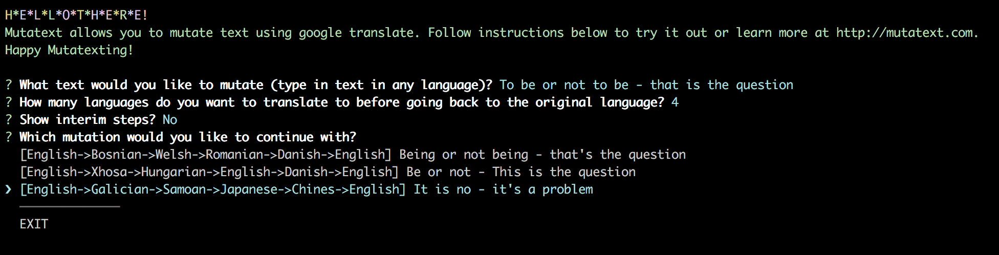

# Mutatext

_found in translation_

CLI-based Proof of concept for a creative tool that works via translating back and forth.

### Why:

Creatives have long used the dictionary and thesaurus as their go-to tools. Translating text back and forth is a possible continuation and expansion of that. You can explore concepts and related ideas based on imperfect relationships between languages and quirks of automated translation technology.

Also sometimes results are _really funny_. 

### How it works:

1. you type in or paste any text in any language
2. the system uses google translate API to translate your text back and forth into a few random languages before translating back into original language
3. this is done several times to create a few mutated versions of your original text
4. mutated options are presented back to you and you can make a choice to continue with one of them (back to step 2) or to exit (and then the chain of transformations will be shown to you).

### How to use:

* make sure you have a modern version of node.js installed
* clone this repo
* `npm i`
* `node index.js`
* follow instructions on screen

### Known issues & limitations:

* `[` and `]` are reserved characters. Text including them is not supported.
* may be subject to API rate limiting

## TODO:

* error handling and basic validation
* exclude already used languages when doing each next translation
* better delimiter than ']'
* refactor to separate functions

## DONE:

* explanation text and better UI
* show translation path (en->zh->ru) etc.
* record transformations
* maintain original text language as detected throughout cycles
